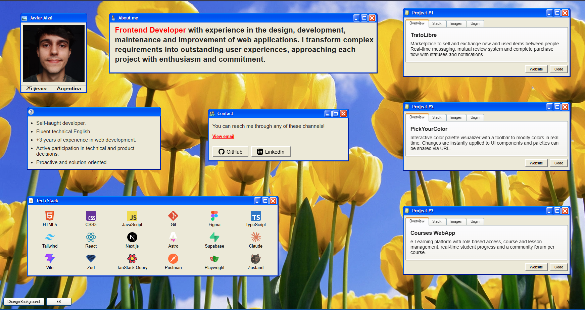
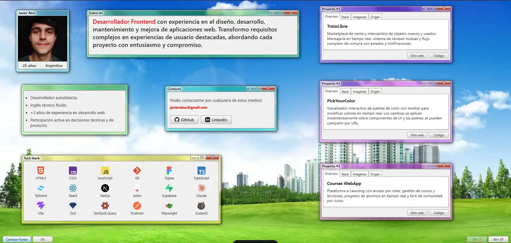

# My Portfolio

This is a my personal portfolio built with Astro, using HTML, CSS and TypeScript.

The project is inspired by Windows 7 and Windows Vista aesthetics. It includes two visual modes that replicate those styles. The interface is designed as a single view without scrolling, so everything is immediately accessible and fast to explore.
Really aesthetic and visually pleasing interface, customizable background-image and window styles

## Tech Stack

- Astro
- HTML
- CSS
- TypeScript

## Features

- Retro UI inspired by Windows 7 and Vista
- Single screen layout (no scroll)
- Multi-language support
- Dynamic CSS for theme switching
- Optimized image loading for better performance
- Basic protection against scraping using RTL-based CSS inversion

### Windows 7 Style

### Windows Vista Style

## Commands

Run all commands from the project root:

- `npm install` — install dependencies
- `npm run dev` — start development server
- `npm run build` — build for production
- `npm run preview` — preview production build
